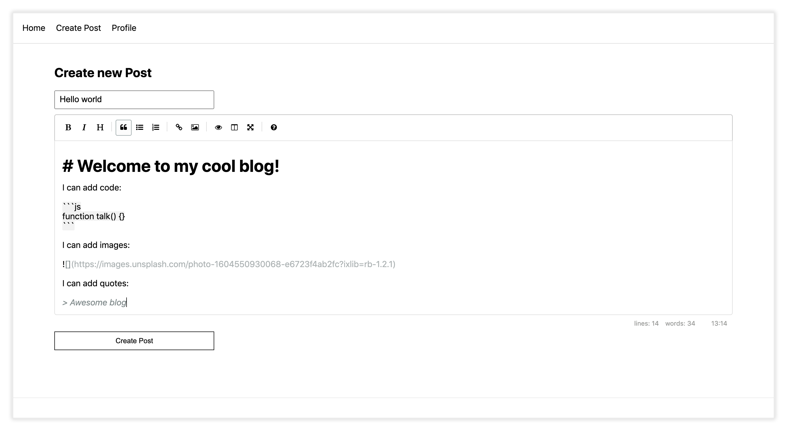
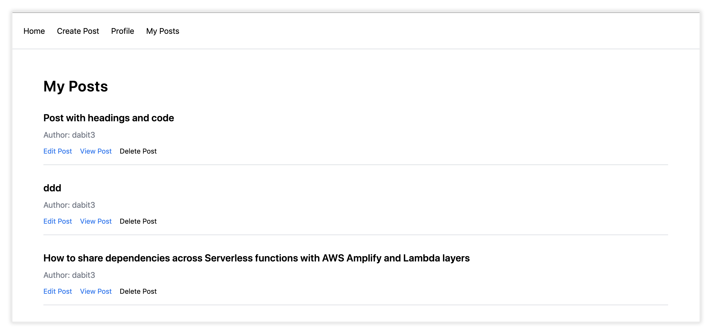
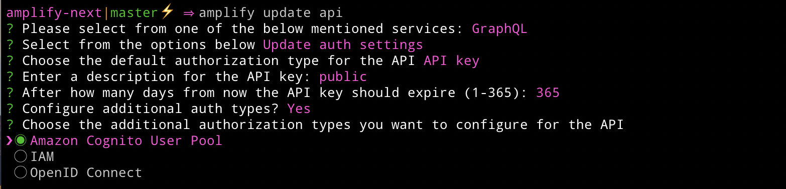

# Next.js AWS Amplify Workshop


In this workshop we'll learn how to build a full stack cloud application with Next.js, GraphQL, & [Amplify](https://docs.amplify.aws/).

<details>
  <summary>What you'll be building.</summary>





</details>

### Overview

We'll start from scratch, creating a new Next.js app. We'll then, step by step, use the [Amplify CLI](https://github.com/aws-amplify/amplify-cli) to build out and configure our cloud infrastructure and then use the [Amplify JS Libraries](https://github.com/aws-amplify/amplify-js) to connect the Next.js app to the APIs we create using the CLI.

The app will be a blogging app with a markdown editor. When you think of many types of applications like Instagram, Twitter, or Facebook, they consist of a list of items and often the ability to drill down into a single item view. The app we will be building will be very similar to this, displaying a list of posts with data like the title, content, and author of the post.

This workshop should take you anywhere between 3 to 6 hours to complete.

### Environment & prerequisites

Before we begin, make sure you have the following:

- Node.js v10.x or later  installed
- A valid and confirmed AWS account

We will be working from a terminal using a [Bash shell](https://en.wikipedia.org/wiki/Bash_(Unix_shell)) to run Amplify CLI commands to provision infrastructure and also to run a local version of the Next.js app and test it in a web browser.

### Background needed / level

This workshop is intended for intermediate to advanced front end & back end developers wanting to learn more about full stack serverless development.

While some level of React and GraphQL is helpful, this workshop requires zero previous knowledge about React or GraphQL.

### Topics we'll be covering:

- GraphQL API with AWS AppSync
- Authentication
- Authorization
- Hosting
- Deleting the resources

## Getting Started - Creating the Next.js Application

To get started, we first need to create a new Next.js project.

```bash
$ npx create-next-app amplify-next
```

Now change into the new app directory & install AWS Amplify, & AWS Amplify UI React:

```bash
$ cd amplify-next
$ npm install aws-amplify @aws-amplify/ui-react react-simplemde-editor react-markdown uuid
```

Since we will be using Tailwind, let's also install the tailwind dependencies:

```sh
npm install tailwindcss@latest postcss@latest autoprefixer@latest @tailwindcss/typography
```

Next, create the necessary Tailwind configuration files:

```sh
npx tailwindcss init -p
```

Now update __tailwind.config.js__ to add the Tailwind `typography` plugin to the array of plugins:

```js
plugins: [
  require('@tailwindcss/typography')
],
```

Finally, replace the styles in __styles.globals.css__ with the following:

```css
@tailwind base;
@tailwind components;
@tailwind utilities;
```

## Installing the CLI & Initializing a new AWS Amplify Project

### Installing the CLI

Next, we'll install the AWS Amplify CLI:

```bash
# NPM
$ npm install -g @aws-amplify/cli

# cURL (Mac & Linux)
curl -sL https://aws-amplify.github.io/amplify-cli/install | bash && $SHELL

# cURL (Windows)
curl -sL https://aws-amplify.github.io/amplify-cli/install-win -o install.cmd && install.cmd
```

Now we need to configure the CLI with our credentials.

> If you'd like to see a video walkthrough of this configuration process, click [here](https://www.youtube.com/watch?v=fWbM5DLh25U).

```sh
$ amplify configure

- Specify the AWS Region: us-east-1 || us-west-2 || eu-central-1
- Specify the username of the new IAM user: amplify-cli-user
> In the AWS Console, click Next: Permissions, Next: Tags, Next: Review, & Create User to create the new IAM user. Then return to the command line & press Enter.
- Enter the access key of the newly created user:   
? accessKeyId: (<YOUR_ACCESS_KEY_ID>)  
? secretAccessKey: (<YOUR_SECRET_ACCESS_KEY>)
- Profile Name: amplify-cli-user
```

### Initializing A New Project

```bashin
$ amplify init

- Enter a name for the project: amplifynext
- Enter a name for the environment: dev
- Choose your default editor: Visual Studio Code (or your default editor)
- Please choose the type of app that youre building: javascript
- What javascript framework are you using: react
- Source Directory Path: . (this sets the base directory to the root directory)
- Distribution Directory Path: .next
- Build Command: npm run-script build
- Start Command: npm run-script start
- Do you want to use an AWS profile? Y
- Please choose the profile you want to use: amplify-cli-user (or your preferred profile)
```

The Amplify CLI has initialized a new project & you will see a new folder: __amplify__ & a new file called `aws-exports.js` in the root directory. These files hold your project configuration.

To view the status of the amplify project at any time, you can run the Amplify `status` command:

```sh
$ amplify status
```

To view the amplify project in the Amplify console at any time, run the `console` command:

```sh
$ amplify console
```

## Adding an AWS AppSync GraphQL API

To add a GraphQL API, we can use the following command:

```sh
$ amplify add api

? Please select from one of the above mentioned services: GraphQL
? Provide API name: NextBlog
? Choose the default authorization type for the API: API key
? Enter a description for the API key: public
? After how many days from now the API key should expire (1-365): 365 (or your preferred expiration)
? Do you want to configure advanced settings for the GraphQL API: No
? Do you have an annotated GraphQL schema? N 
? Choose a schema template: Single object with fields
? Do you want to edit the schema now? (Y/n) Y
```

The CLI should open this GraphQL schema in your text editor.

__amplify/backend/api/NextBlog/schema.graphql__

Update the schema to the following:   

```graphql
type Post @model {
  id: ID!
  title: String!
  content: String!
}
```

After saving the schema, go back to the CLI and press enter.

### Deploying the API

To deploy the API, run the push command:

```
$ amplify push

? Are you sure you want to continue? Y

# You will be walked through the following questions for GraphQL code generation
? Do you want to generate code for your newly created GraphQL API? Y
? Choose the code generation language target: javascript
? Enter the file name pattern of graphql queries, mutations and subscriptions: ./graphql/**/*.js
? Do you want to generate/update all possible GraphQL operations - queries, mutations and subscriptions? Yes
? Enter maximum statement depth [increase from default if your schema is deeply nested]: 2
```

Now the API is live and you can start interacting with it!

### Testing the API

To test it out we can use the GraphiQL editor in the AppSync dashboard. To open the AppSync dashboard, run the following command:

```sh
$ amplify console api

> Choose GraphQL
```

In the AppSync dashboard, click on __Queries__ to open the GraphiQL editor. In the editor, create a new post with the following mutation:

```graphql
mutation createPost {
  createPost(input: {
    title: "My first post"
    content: "Hello world!"
  }) {
    id
    title
    content
  }
}
```

Then, query for the posts:

```graphql
query listPosts {
  listPosts {
    items {
      id
      title
      content
    }
  }
}
```

### Configuring the Next app

Now, our API is created & we can test it out in our app!

The first thing we need to do is to configure our Next.js app to be aware of our Amplify project. We can do this by referencing the auto-generated `aws-exports.js` file that was created by the CLI.

Create a new file called __configureAmplify.js__ in the root of the project and add the following code:


```js
import Amplify from 'aws-amplify'
import config from './aws-exports'
Amplify.configure(config)
```

Next, open __pages/\_app.js__ and import the Amplify configuration below the last import:

```js
import '../configureAmplify'
```

Now, our app is ready to start using our AWS services.

### Interacting with the GraphQL API from the Next.js application - Querying for data

Now that the GraphQL API is running we can begin interacting with it. The first thing we'll do is perform a query to fetch data from our API.

To do so, we need to define the query, execute the query, store the data in our state, then list the items in our UI.

The main thing to notice in this component is the API call. Take a look at this piece of code:

```js
/* Call API.graphql, passing in the query that we'd like to execute. */
const postData = await API.graphql({ query: listPosts })
```

Open __pages/index.js__ and add the following code:

```js
import { useState, useEffect } from 'react'
import Link from 'next/link'
import { API } from 'aws-amplify'
import { listPosts } from '../graphql/queries'

export default function Home() {
  const [posts, setPosts] = useState([])
  useEffect(() => {
    fetchPosts()
  }, [])
  async function fetchPosts() {
    const postData = await API.graphql({
      query: listPosts
    })
    setPosts(postData.data.listPosts.items)
  }
  return (
    <div>
      <h1 className="text-3xl font-semibold tracking-wide mt-6 mb-2">Posts</h1>
      {
        posts.map((post, index) => (
        <Link key={index} href={`/posts/${post.id}`}>
          <div className="cursor-pointer border-b border-gray-300	mt-8 pb-4">
            <h2>{post.title}</h2>
          </div>
        </Link>)
        )
      }
    </div>
  )
}
```

Next, start the app:

```sh
$ npm run dev
```

You should be able to view the list of posts. You will not yet be able to click on a post to navigate to the detail view, that is coming up later.

## Adding authentication

Next, let's add some authentication.

To add the authentication service, run the following command using the Amplify CLI:

```sh
$ amplify add auth

? Do you want to use default authentication and security configuration? Default configuration 
? How do you want users to be able to sign in when using your Cognito User Pool? Username
? Do you want to configure advanced settings? No, I am done. 
```

To deploy the authentication service, you can run the push command:

```sh
$ amplify push

? Are you sure you want to continue? Yes
```

Next, let's add a profile screen and login flow to the app.

To do so, create a new file called __profile.js__ in the __pages__ directory. Here, add the following code:

```js
import { withAuthenticator, AmplifySignOut } from '@aws-amplify/ui-react'
import { Auth } from 'aws-amplify'
import { useState, useEffect } from 'react'

function Profile() {
  const [user, setUser] = useState(null)
  useEffect(() => {
    checkUser()
  }, [])
  async function checkUser() {
    const user = await Auth.currentAuthenticatedUser()
    setUser(user)
  }
  if (!user) return null
  return (
    <div>
      <h1 className="text-3xl font-semibold tracking-wide mt-6">Profile</h1>
      <h3 className="font-medium text-gray-500 my-2">Username: {user.username}</h3>
      <p className="text-sm text-gray-500 mb-6">Email: {user.attributes.email}</p>
      <AmplifySignOut />
    </div>
  )
}

export default withAuthenticator(Profile)
```

The `withAuthenticator` Amplify UI component will scaffold out an entire authentication flow to allow users to sign up and sign in.

The `AmplifySignOut` button adds a pre-style sign out button.

Next, add some styling to the UI component by opening __styles/globals.css__ and adding the following code:

```css
:root {
  --amplify-primary-color: #0072ff;
  --amplify-primary-tint: #0072ff;
  --amplify-primary-shade: #0072ff;
}
```

Next, open __pages/\_app.js__ to add some navigation and styling to be able to navigate to the new Profile page:

```js
import '../styles/globals.css'
import '../configureAmplify'
import Link from 'next/link'

function MyApp({ Component, pageProps }) {
  return (
  <div>
    <nav className="p-6 border-b border-gray-300">
      <Link href="/">
        <span className="mr-6 cursor-pointer">Home</span>
      </Link>
      <Link href="/create-post">
        <span className="mr-6 cursor-pointer">Create Post</span>
      </Link>
      <Link href="/profile">
        <span className="mr-6 cursor-pointer">Profile</span>
      </Link>
    </nav>
    <div className="py-8 px-16">
      <Component {...pageProps} />
    </div>
  </div>
  )
}

export default MyApp
```

Next, run the app:

```sh
$ npm run dev
```

You should now be able to sign up and view your profile.

> The link to __/create-post__ will not yet work as we have not yet created this page.

## Adding authorization

Next, update the API to enable another authorization type to enable both public and private API access.

```sh
$ amplify update api

? Please select from one of the below mentioned services: GraphQL   
? Select from the options below: Update auth settings
? Choose the default authorization type for the API: API key
? Enter a description for the API key: public
? After how many days from now the API key should expire (1-365): 365 <or your preferred expiration>
? Configure additional auth types? Y
? Choose the additional authorization types you want to configure for the API: Amazon Cognito User Pool
```



Next, let's update the GraphQL schema with the following changes:

1. A new field (`username`) to identify the author of a post.
2. An `@key` directive for enabling a new data access pattern to query posts by username

Open __amplify/backend/api/NextBlog/schema.graphql__ and update it with the following:

```graphql
type Post @model
  @key(name: "postsByUsername", fields: ["username"], queryField: "postsByUsername")
  @auth(rules: [
    { allow: owner, ownerField: "username" },
    { allow: public, operations: [read] }
  ]) {
  id: ID!
  title: String!
  content: String!
  username: String
}
```

Next, deploy the updates:

```sh
$ amplify push --y
```

Now, you will have two types of API access:

1. Private (Cognito) - to create a post, a user must be signed in. Once they have created a post, they can update and delete their own post. They can also read all posts.
2. Public (API key) - Any user, regardless if they are signed in, can query for posts or a single post.
Using this combination, you can easily query for just a single user's posts or for all posts.

To make this secondary private API call from the client, the authorization type needs to be specified in the query or mutation:

```js
const postData = await API.graphql({
  mutation: createPost,
  authMode: 'AMAZON_COGNITO_USER_POOLS',
  variables: {
    input: postInfo
  }
})
```

## Adding the Create Post form and page

Next, create a new page at __pages/create-post.js__ and add the following code:

```js
import { withAuthenticator } from '@aws-amplify/ui-react'
import { useState } from 'react'
import { API } from 'aws-amplify'
import { v4 as uuid } from 'uuid'
import { useRouter } from 'next/router'
import SimpleMDE from "react-simplemde-editor"
import "easymde/dist/easymde.min.css"
import { createPost } from '../graphql/mutations'

const initialState = { title: '', content: '' }

function CreatePost() {
  const [post, setPost] = useState(initialState)
  const { title, content } = post
  const router = useRouter()
  function onChange(e) {
    setPost(() => ({ ...post, [e.target.name]: e.target.value }))
  }
  async function createNewPost() {
    if (!title || !content) return
    const id = uuid()
    post.id = id

    await API.graphql({
      query: createPost,
      variables: { input: post },
      authMode: "AMAZON_COGNITO_USER_POOLS"
    })
    router.push(`/posts/${id}`)
  }
  return (
    <div>
      <h1 className="text-3xl font-semibold tracking-wide mt-6">Create new post</h1>
      <input
        onChange={onChange}
        name="title"
        placeholder="Title"
        value={post.title}
        className="border-b pb-2 text-lg my-4 focus:outline-none w-full font-light text-gray-500 placeholder-gray-500 y-2"
      /> 
      <SimpleMDE value={post.content} onChange={value => setPost({ ...post, content: value })} />
      <button
        type="button"
        className="mb-4 bg-blue-600 text-white font-semibold px-8 py-2 rounded-lg"
        onClick={createNewPost}
      >Create Post</button>
    </div>
  )
}

export default withAuthenticator(CreatePost)
```

This will render a form and a markdown editor, allowing users to create new posts.

Next, create a new folder in the __pages__ directory called __posts__ and a file called __[id].js__ within that folder. In __pages/posts/[id].js__, add the following code:

```js
import { API } from 'aws-amplify'
import { useRouter } from 'next/router'
import ReactMarkdown from 'react-markdown'
import '../../configureAmplify'
import { listPosts, getPost } from '../../graphql/queries'

export default function Post({ post }) {
  const router = useRouter()
  if (router.isFallback) {
    return <div>Loading...</div>
  }
  return (
    <div>
      <h1 className="text-5xl mt-4 font-semibold tracking-wide">{post.title}</h1>
      <p className="text-sm font-light my-4">by {post.username}</p>
      <div className="mt-8">
        <ReactMarkdown className='prose' children={post.content} />
      </div>
    </div>
  )
}

export async function getStaticPaths() {
  const postData = await API.graphql({
    query: listPosts
  })
  const paths = postData.data.listPosts.items.map(post => ({ params: { id: post.id }}))
  return {
    paths,
    fallback: true
  }
}

export async function getStaticProps ({ params }) {
  const { id } = params
  const postData = await API.graphql({
    query: getPost, variables: { id }
  })
  return {
    props: {
      post: postData.data.getPost
    }
  }
}
```

This page uses `getStaticPaths` to dynamically create pages at build time based on the posts coming back from the API.

We also use the `fallback` flag to enable fallback routes for dynamic SSG page generation.

`getStaticProps` is used to enable the Post data to be passed into the page as props at build time.

Finally, update __pages/index.js__ to add the author field and author styles:

```js
import { useState, useEffect } from 'react'
import Link from 'next/link'
import { API } from 'aws-amplify'
import { listPosts } from '../graphql/queries'

export default function Home() {
  const [posts, setPosts] = useState([])
  useEffect(() => {
    fetchPosts()
  }, [])
  async function fetchPosts() {
    const postData = await API.graphql({
      query: listPosts
    })
    setPosts(postData.data.listPosts.items)
  }
  return (
    <div>
      <h1 className="text-3xl font-semibold tracking-wide mt-6 mb-2">Posts</h1>
      {
        posts.map((post, index) => (
        <Link key={index} href={`/posts/${post.id}`}>
          <div className="cursor-pointer border-b border-gray-300	mt-8 pb-4">
            <h2 className="text-xl font-semibold">{post.title}</h2>
            <p className="text-gray-500 mt-2">Author: {post.username}</p>
          </div>
        </Link>)
        )
      }
    </div>
  )
}
```

### Deleting existing data

Now the app is ready to test out, but before we do let's delete the existing data in the database that does not contain an author field. To do so, follow these steps:

1. Open the Amplify Console

```sh
$ amplify console api

> Choose GraphQL
```

2. Click on __Data sources__
3. Click on the link to the database
4. Click on the __Items__ tab.
5. Select the items in the database and delete them by choosing __Delete__ from the __Actions__ button.

Next, run the app:

```sh
$ npm run dev
```

You should be able to create new posts and view them dynamically.

### Running a build

To run a build and test it out, run the following:

```sh
$ npm run build

$ npm start
```

## Adding a filtered view for signed in user's posts

In a future step, we will be enabling the ability to edit or delete the posts that were created by the signed in user. Before we enable that functionality, let's first create a page for only viewing the posts created by the signed in user.

To do so, create a new file called __my-posts.js__ in the pages directory. This page will be using the `postsByUsername` query, passing in the username of the signed in user to query for only posts created by that user.

```js
// pages/my-posts.js
import { useState, useEffect } from 'react'
import Link from 'next/link'
import { API, Auth } from 'aws-amplify'
import { postsByUsername } from '../graphql/queries'

export default function MyPosts() {
  const [posts, setPosts] = useState([])
  useEffect(() => {
    fetchPosts()
  }, [])
  async function fetchPosts() {
    const { username } = await Auth.currentAuthenticatedUser()
    const postData = await API.graphql({
      query: postsByUsername, variables: { username }
    })
    setPosts(postData.data.postsByUsername.items)
  }
  return (
    <div>
      <h1 className="text-3xl font-semibold tracking-wide mt-6 mb-2">My Posts</h1>
      {
        posts.map((post, index) => (
        <Link key={index} href={`/posts/${post.id}`}>
          <div className="cursor-pointer border-b border-gray-300	mt-8 pb-4">
            <h2 className="text-xl font-semibold">{post.title}</h2>
            <p className="text-gray-500 mt-2">Author: {post.username}</p>
          </div>
        </Link>)
        )
      }
    </div>
  )
}
```

### Updating the nav

Next, we need to update the nav to show the link to the new __my-posts__ page, but only show the link if there is a signed in user.

To do so, we'll be using a combination of the `Auth` class as well as `Hub` which allows us to listen to authentication events.

Open __pages/\_app.js__ and make the following updates:

1. Import the `useState` and `useEffect` hooks from React as well as the `Auth` and `Hub` classes from AWS Amplify:

```js
import { useState, useEffect } from 'react'
import { Auth, Hub } from 'aws-amplify'
```

2. In the `MyApp` function, create some state to hold the signed in user state:

```js
const [signedInUser, setSignedInUser] = useState(false)
```

3. In the `MyApp` function, create a function to detect and maintain user state and invoke it in a `useEffect` hook:

```js
useEffect(() => {
  authListener()
})
async function authListener() {
  Hub.listen('auth', (data) => {
    switch (data.payload.event) {
      case 'signIn':
        return setSignedInUser(true)
      case 'signOut':
        return setSignedInUser(false)
    }
  })
  try {
    await Auth.currentAuthenticatedUser()
    setSignedInUser(true)
  } catch (err) {}
}
```

4. In the navigation, add a link to the new route to show only if a user is currently signed in:

```js
{
  signedInUser && (
    <Link href="/my-posts">
      <span className="mr-6 cursor-pointer">My Posts</span>
    </Link>
  )
}
```

Next, test it out by restarting the dev server:

```sh
npm run dev
```

## Updating and deleting posts

Next, let's add a way for a signed in user to edit and delete their posts.

First, create a new folder named __edit-post__ in the __pages__ directory. Then, create a file named __[id].js__ in this folder.

In this file, we'll be accessing the `id` of the post from a route parameter. When the component loads, we will then use the post id from the route to fetch the post data and make it available for editing.

In this file, add the following code:

```js
// pages/edit-post/[id].js
import { useEffect, useState } from 'react'
import { API } from 'aws-amplify'
import { useRouter } from 'next/router'
import SimpleMDE from "react-simplemde-editor"
import "easymde/dist/easymde.min.css"
import { updatePost } from '../../graphql/mutations'
import { getPost } from '../../graphql/queries'

function EditPost() {
  const [post, setPost] = useState(null)
  const router = useRouter()
  const { id } = router.query

  useEffect(() => {
    fetchPost()
    async function fetchPost() {
      if (!id) return
      const postData = await API.graphql({ query: getPost, variables: { id }})
      setPost(postData.data.getPost)
    }
  }, [id])
  if (!post) return null
  function onChange(e) {
    setPost(() => ({ ...post, [e.target.name]: e.target.value }))
  }
  const { title, content } = post
  async function updateCurrentPost() {
    if (!title || !content) return
    await API.graphql({
      query: updatePost,
      variables: { input: { title, content, id } },
      authMode: "AMAZON_COGNITO_USER_POOLS"
    })
    console.log('post successfully updated!')
    router.push('/my-posts')
  }
  return (
    <div>
      <h1 className="text-3xl font-semibold tracking-wide mt-6 mb-2">Edit post</h1>
      <input
        onChange={onChange}
        name="title"
        placeholder="Title"
        value={post.title}
        className="border-b pb-2 text-lg my-4 focus:outline-none w-full font-light text-gray-500 placeholder-gray-500 y-2"
      /> 
      <SimpleMDE value={post.content} onChange={value => setPost({ ...post, content: value })} />
      <button
        className="mb-4 bg-blue-600 text-white font-semibold px-8 py-2 rounded-lg"
        onClick={updateCurrentPost}>Update Post</button>
    </div>
  )
}

export default EditPost       
```

Next, open __pages/my-posts.js__. We'll make a few updates to this page:

1. Create a function for deleting a post
2. Add a link to edit the post by navigating to `/edit-post/:postID`
3. Add a link to view the post
4. Create a button for deleting posts

Update this file with the following code:

```js
// pages/my-posts.js
import { useState, useEffect } from 'react'
import Link from 'next/link'
import { API, Auth } from 'aws-amplify'
import { postsByUsername } from '../graphql/queries'
import { deletePost as deletePostMutation } from '../graphql/mutations'

export default function MyPosts() {
  const [posts, setPosts] = useState([])
  useEffect(() => {
    fetchPosts()
  }, [])
  async function fetchPosts() {
    const { username } = await Auth.currentAuthenticatedUser()
    const postData = await API.graphql({
      query: postsByUsername, variables: { username }
    })
    setPosts(postData.data.postsByUsername.items)
  }
  async function deletePost(id) {
    await API.graphql({
      query: deletePostMutation,
      variables: { input: { id } },
      authMode: "AMAZON_COGNITO_USER_POOLS"
    })
    fetchPosts()
  }
  return (
    <div>
      <h1 className="text-3xl font-semibold tracking-wide mt-6 mb-2">My Posts</h1>
      {
        posts.map((post, index) => (
          <div key={index} className="border-b border-gray-300	mt-8 pb-4">
            <h2 className="text-xl font-semibold">{post.title}</h2>
            <p className="text-gray-500 mt-2 mb-2">Author: {post.username}</p>
            <Link href={`/edit-post/${post.id}`}><a className="text-sm mr-4">Edit Post</a></Link>
            <Link href={`/posts/${post.id}`}><a className="text-sm mr-4">View Post</a></Link>
            <button
              className="text-sm mr-4"
              onClick={() => deletePost(post.id)}
            >Delete Post</button>
          </div>
        ))
      }
    </div>
  )
}
```

### Enabling Incremental Static Generation

The last thing we need to do is implement [Incremental Static Generation](https://nextjs.org/docs/basic-features/data-fetching#incremental-static-regeneration). Since we are allowing users to update posts, we need to have a way for our site to render the newly updated posts. 

Incremental Static Regeneration allows you to update existing pages by re-rendering them in the background as traffic comes in.

To enable this, open __pages/posts/[id].js__ and update the `getStaticProps` method with the following:

```js

export async function getStaticProps ({ params }) {
  const { id } = params
  const postData = await API.graphql({
    query: getPost, variables: { id }
  })
  return {
    props: {
      post: postData.data.getPost
    },
    // Next.js will attempt to re-generate the page:
    // - When a request comes in
    // - At most once every second
    revalidate: 1 // adds Incremental Static Generation, sets time in seconds
  }
}
```

To test it out, restart the server or run a new build:

```sh
npm run dev

# or

npm run build && npm start
```

## Deployment with Serverless Framework

To deploy to AWS, create a new file at the root of the app called __serverless.yml__. In this file, add the following configuration:

```yaml
nextamplified:
  component: "@sls-next/serverless-component@1.18.0"
```

To deploy, run the following command from your terminal:

```
npx serverless
```

## Removing Services

If at any time, or at the end of this workshop, you would like to delete a service from your project & your account, you can do this by running the `amplify remove` command:

```sh
$ amplify remove auth

$ amplify push
```

If you are unsure of what services you have enabled at any time, you can run the `amplify status` command:

```sh
$ amplify status
```

`amplify status` will give you the list of resources that are currently enabled in your app.

### Deleting the Amplify project and all services

If you'd like to delete the entire project, you can run the `delete` command:

```sh
$ amplify delete
```

## Next steps / challenge

1. Enable updating posts
2. Enable deleting posts
